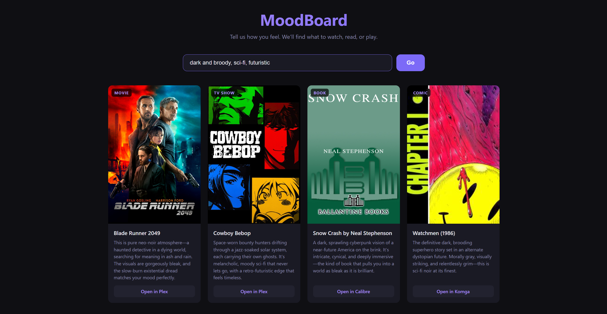

# MoodBoard

Type how you're feeling and get one recommendation from each of your four personal media libraries — movie, TV show, book, and comic — with a personalised pitch for why it fits your mood right now.



## How it works

1. **FastAPI backend** queries Plex, Calibre, and Komga on startup and caches the full library
2. The library is sent to **Claude Haiku** as a cached system prompt (~$0.005/request on cache hits)
3. Claude picks one item per category and writes a 2-3 sentence pitch explaining why it fits the mood
4. Cover art is proxied through the backend — no credentials exposed to the browser
5. Each card links directly into the relevant app (Plex, Calibre-Web, Komga)

## Stack

- Python / FastAPI / Uvicorn
- Anthropic Claude Haiku with prompt caching
- Vanilla HTML/CSS/JS frontend
- Docker + Docker Compose

## Requirements

- [Plex](https://www.plex.tv/) — movies & TV
- [Calibre-Web-Automated](https://github.com/crocodilestick/Calibre-Web-Automated) — books (with mood tags in Calibre)
- [Komga](https://komga.org/) — comics
- [Anthropic API key](https://console.anthropic.com/)

Books work best when tagged with mood/vibe tags ("cozy", "grimdark", "atmospheric", etc.) rather than just genre. See the Claude mood tagger in the companion scripts.

## Setup

```bash
cp .env.example .env
# Fill in your values
docker compose up -d
```

The compose file expects the Calibre library mounted at the path specified in `.env`, and assumes Plex, Komga are reachable on your local network.

## Key design decision: prompt caching

The entire library (~36k tokens) is cached in Claude's context. First request per 5-minute window costs ~$0.04; subsequent requests cost ~$0.005. A heavily-used family app costs less than a dollar a month.
